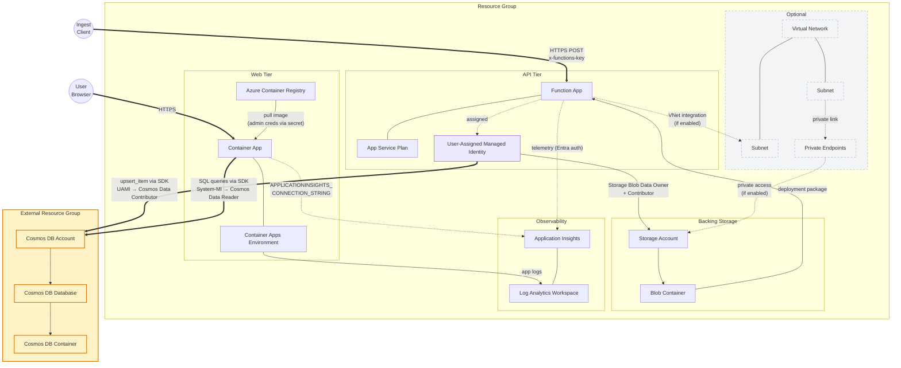

# End-to-End Agentic DevOps with Azure MCP — Ship, Harden, Break, Investigate

**Hands-On Lab (75 min) | Level: 300 | LAB501**

AI can deploy your app to Azure in 5 minutes. But should you trust what it built? In this lab, you'll use GitHub Copilot CLI with Azure skills to deploy a live Container App — a Python Flask application that browses a LEGO set catalog backed by Azure Cosmos DB — along with a Function App that upserts new LEGO sets into Cosmos DB. Then, you'll put on your architect hat and evaluate the AI's decisions. You'll review the generated Bicep files, identify what's missing for production readiness, direct the AI to harden the deployment, intentionally break the app, and run a full forensic investigation — all without opening the Azure Portal.

> 💡 **AI responses may vary** from what's described in this guide. Focus on which skills activate and the reasoning patterns, not exact output. The prompts are tested, but AI is non-deterministic — your results may look slightly different.

### Target Architecture

## What You'll Learn

- How Azure **skills** chain together — one prompt can trigger `prepare` → `validate` → `deploy` automatically
- Where AI-generated infrastructure gets you to 80% — and the production gaps you need to close
- How to critically review AI-generated Bicep, Dockerfiles, and architecture diagrams
- How `azure-diagnostics` reasons through problems: triage patterns, log correlation, KQL generation
- When to trust the AI's decisions and when to override them
- How to connect a containerized app to a pre-provisioned Azure Cosmos DB using managed identity

## Skills Used — 6 Skills Across 4 Scenarios

| # | Skill | What It Does | Scenario |
|---|---|---|---|
| 1 | `azure-prepare` | Handles two starting points in one pass: wraps IaC + config around the existing Flask source code (Container Apps) **and** fetches a Python Azure Functions template and tailors it to the prompt (Flex Consumption) | 1A: Ship |
| 2 | `azure-validate` | Pre-flight checks: Bicep compilation, Docker status (Container Apps), Python runtime + Flex Consumption availability (Functions), subscription access | 1A: Ship |
| 3 | `azure-deploy` | Runs `azd up` — provisions infrastructure + builds + deploys both services (Flask Container App and Python Function App) | 1A: Ship |
| 4 | `azure-rbac` | Finds least-privilege roles from Azure docs, generates assignment commands | 1B: Harden |
| 5 | `azure-resource-visualizer` | Queries Resource Graph, maps relationships, generates Mermaid diagrams | 2: See |
| 6 | `azure-diagnostics` | Pulls system logs, follows diagnostic reasoning chain to root cause; writes KQL queries, creates alert rules | 3: Break, 4: Investigate |

> 📖 **Glossary:** **ACR** = Azure Container Registry (private Docker image store). **AZD** = Azure Developer CLI (`azd`). **Bicep** = Azure's IaC language. **Cosmos DB** = Azure's globally distributed NoSQL database. **KQL** = Kusto Query Language (for log queries). **MCP** = Model Context Protocol.

## Lab Sections

| # | Section | File | Duration |
|---|---------|------|----------|
| 1 | [Prerequisites](01-prerequisites.md) | `01-prerequisites.md` | Pre-session |
| 2 | [Login & Launch](02-login-and-launch.md) | `02-login-and-launch.md` | ~5 min |
| 3 | [Set Up the Starter App](03-getting-started.md) | `03-getting-started.md` | ~5 min |
| 4 | [Scenario 1 — Ship It & Harden It](04-scenario-1-ship-and-harden.md) | `04-scenario-1-ship-and-harden.md` | ~25 min |
| 5 | [Scenario 2 — See It & Evaluate It](05-scenario-2-see-and-evaluate.md) | `05-scenario-2-see-and-evaluate.md` | ~10 min |
| 6 | [Scenario 3 — Break It & Triage It](06-scenario-3-break-and-triage.md) | `06-scenario-3-break-and-triage.md` | ~10 min |
| 7 | [Scenario 4 — Investigate & Operationalize](07-scenario-4-investigate-and-operationalize.md) | `07-scenario-4-investigate-and-operationalize.md` | ~15 min |
| 8 | [Troubleshooting](08-troubleshooting.md) | `08-troubleshooting.md` | Reference |
| 9 | [What's Next](09-whats-next.md) | `09-whats-next.md` | Reference |

## Korean Guide

For Build Localhost Seoul attendees, full Korean versions are available:

- [Korean Guide Index](ko/README.md)
- [Overview (Korean)](ko/00-overview.ko.md)
- [Prerequisites (Korean)](ko/01-prerequisites.ko.md)
- [Before You Begin - Login & Launch (Korean)](ko/02-login-and-launch.ko.md)
- [Set Up the Starter App (Korean)](ko/03-getting-started.ko.md)
- [Scenario 1 - Ship It & Harden It (Korean)](ko/04-scenario-1-ship-and-harden.ko.md)
- [Scenario 2 - See It & Evaluate It (Korean)](ko/05-scenario-2-see-and-evaluate.ko.md)
- [Scenario 3 - Break It & Triage It (Korean)](ko/06-scenario-3-break-and-triage.ko.md)
- [Scenario 4 - Investigate & Operationalize (Korean)](ko/07-scenario-4-investigate-and-operationalize.ko.md)
- [Troubleshooting (Korean)](ko/08-troubleshooting.ko.md)
- [What's Next (Korean)](ko/09-whats-next.ko.md)
