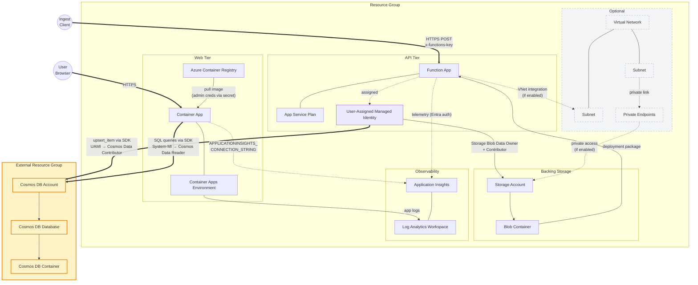

# Azure MCP 기반 에이전트형 DevOps 실습

## 핸즈온 랩 (75분) | 난이도: 300 | LAB501

AI는 5분 만에 Azure 배포를 만들어낼 수 있습니다. 하지만 그 결과를 그대로 신뢰해도 될까요? 이 랩에서는 GitHub Copilot CLI와 Azure skills를 사용해 Azure Container App(LEGO 카탈로그 Flask 앱)과 Azure Cosmos DB 업서트를 수행하는 Function App을 배포합니다. 이후 아키텍트 관점으로 AI 결과물을 평가하고, 생성된 Bicep을 검토해 프로덕션 준비 격차를 찾고, 의도적으로 장애를 유발한 뒤, KQL 기반 포렌식 조사까지 수행합니다.

> 💡 **AI 응답은 달라질 수 있습니다.** 출력 문자열이 완전히 동일한지보다, 어떤 skill이 활성화되고 어떤 추론 패턴을 따르는지에 집중하세요.

## 목표 아키텍처

## 이 실습에서 배우는 것

- 하나의 프롬프트로 `prepare` → `validate` → `deploy` 체인을 호출하는 방법
- AI 생성 인프라의 빠른 생산성과 프로덕션 준비성의 차이
- AI가 만든 Bicep/Dockerfile/아키텍처 다이어그램을 비판적으로 검토하는 방법
- `azure-diagnostics`의 추론 체인(가설 수립, 로그 상관분석, KQL 생성)
- AI를 신뢰할 지점과 사람이 개입해야 할 지점
- managed identity 기반으로 Container App과 Cosmos DB를 연결하는 방법

## 사용되는 스킬 (4개 시나리오, 6개 스킬)

| # | Skill | 역할 | 시나리오 |
| --- | --- | --- | --- |
| 1 | `azure-prepare` | 기존 Flask 코드와 신규 Function 템플릿 생성/조합, IaC와 설정 생성 | 1A: Ship |
| 2 | `azure-validate` | Bicep 컴파일, Docker/런타임/권한/리전 사전 검증 | 1A: Ship |
| 3 | `azure-deploy` | `azd up`로 프로비저닝+빌드+배포 수행 | 1A: Ship |
| 4 | `azure-rbac` | 최소권한 RBAC 역할 탐색 및 할당 명령 생성 | 1B: Harden |
| 5 | `azure-resource-visualizer` | 리소스 관계를 Mermaid 다이어그램으로 시각화 | 2: See |
| 6 | `azure-diagnostics` | 로그 기반 원인 분석, KQL 작성, 알림 규칙 생성 | 3: Break, 4: Investigate |

> 📖 **용어 요약:** ACR = Azure Container Registry, AZD = Azure Developer CLI, Bicep = Azure IaC language, KQL = Kusto Query Language, MCP = Model Context Protocol

## 실습 섹션

| # | 섹션 | 파일 | 예상 시간 |
| --- | --- | --- | --- |
| 1 | [사전 준비](01-prerequisites.ko.md) | `01-prerequisites.ko.md` | 세션 전 |
| 2 | [시작 전 - 로그인 및 런치](02-login-and-launch.ko.md) | `02-login-and-launch.ko.md` | 약 5분 |
| 3 | [스타터 앱 준비](03-getting-started.ko.md) | `03-getting-started.ko.md` | 약 5분 |
| 4 | [시나리오 1 - 배포하고 강화하기](04-scenario-1-ship-and-harden.ko.md) | `04-scenario-1-ship-and-harden.ko.md` | 약 25분 |
| 5 | [시나리오 2 - 보고 평가하기](05-scenario-2-see-and-evaluate.ko.md) | `05-scenario-2-see-and-evaluate.ko.md` | 약 10분 |
| 6 | [시나리오 3 - 장애를 내고 진단하기](06-scenario-3-break-and-triage.ko.md) | `06-scenario-3-break-and-triage.ko.md` | 약 10분 |
| 7 | [시나리오 4 - 조사하고 운영화하기](07-scenario-4-investigate-and-operationalize.ko.md) | `07-scenario-4-investigate-and-operationalize.ko.md` | 약 15분 |
| 8 | [문제 해결](08-troubleshooting.ko.md) | `08-troubleshooting.ko.md` | 참고 |
| 9 | [다음 단계](09-whats-next.ko.md) | `09-whats-next.ko.md` | 참고 |

## 참고 문서

- [용어집](10-glossary.ko.md)
